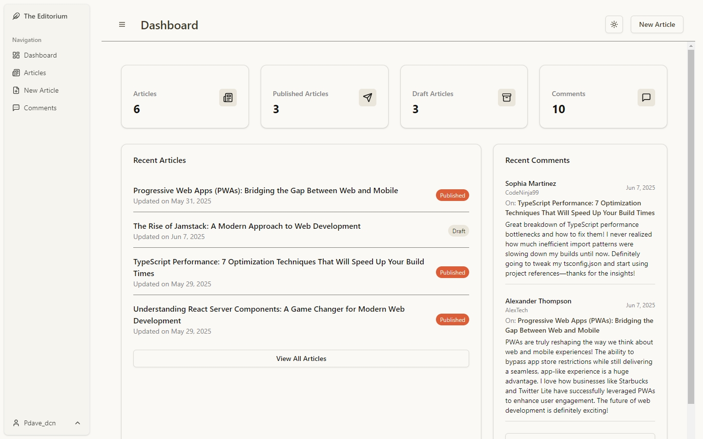
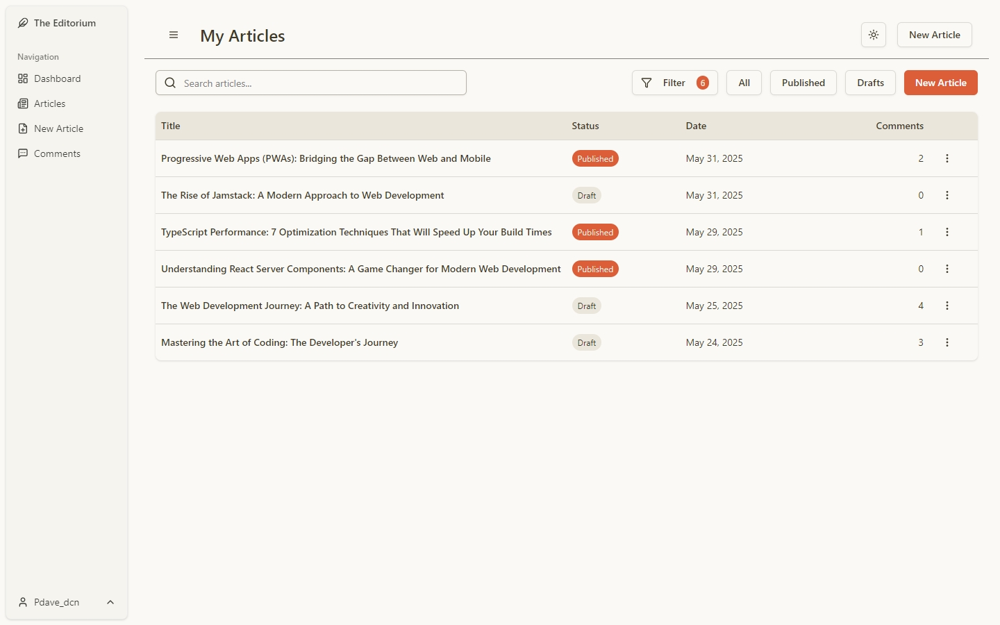
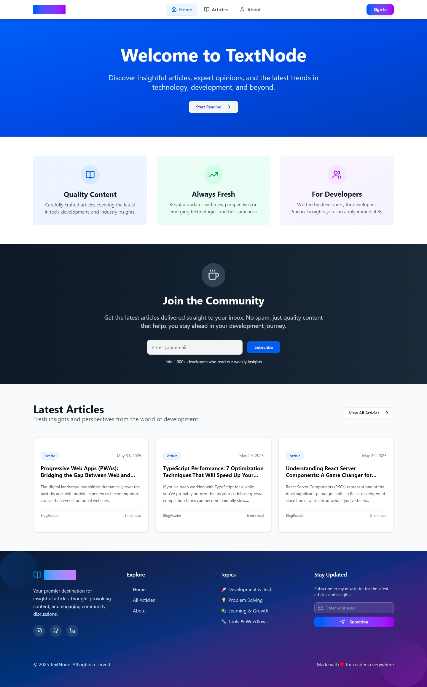

# TextNode

A full-stack blog platform featuring a modern React/TypeScript frontend (with separate reader and editor apps) and a Node.js/Prisma API backend. The project is designed for both readers and content creators, supporting article publishing, commenting, and user roles.

---

## Screenshots






---

## 🚀 Live Demo

### Frontend Reader

- [https://textnode-reader.netlify.app/](https://textnode-reader.netlify.app/)

### Frontend Editor

- [https://textnode-editor.netlify.app/](https://textnode-editor.netlify.app/)

---

## 📁 Project Structure

```bash
blog-project/
│
├── api/                # Node.js + Express + Prisma backend API
│
├── frontend-reader/    # Public-facing blog reader (React + Vite)
│
└── frontend-editor/    # Author/editor dashboard (React + Vite)
```

---

## 🛠 Tech Stack

### Frontend (Reader & Editor)

- React 19 + TypeScript
- Vite
- Tailwind CSS + ShadCN UI (Radix UI primitives)
- Framer Motion / Motion
- React Router
- **TanStack React Query** – server state & caching
- **Zod** – schema validation
- **React Hook Form** – form management
- **Axios** – API client abstraction
- **Zustand** – lightweight client-side state management

### Backend (API)

- Node.js + Express 5
- TypeScript
- Prisma ORM + PostgreSQL
- Passport.js (Local & JWT strategies)
- Cookie-based authentication
- Zod for request validation
- Express Rate Limit
- Pino logging

### Tooling & Dev Experience

- ESLint & Prettier
- Environment-based configuration with dotenv
- Prisma migrations & seeding

---

## Features

### API (`/api`)

- RESTful API built with Express and TypeScript
- Prisma ORM with PostgreSQL
- Cookie-based authentication (JWT stored in HTTP-only cookies)
- Passport.js (Local & JWT strategies)
- Role-based access control (`user`, `author`)
- Draft and published states for articles
- Threaded comments with nested replies
- Request validation with Zod
- Rate limiting and structured logging

### Frontend Reader (`/frontend-reader`)

- Public-facing blog interface
- Browse and read published articles
- Responsive, animated UI
- Threaded comments display
- Server-state management with React Query
- Client-side state via Zustand
- Robust form validation using Zod + React Hook Form

### Frontend Editor (`/frontend-editor`)

- Secure author dashboard
- Rich text editing with TinyMCE
- Article creation, editing, publishing, and draft management
- Comment moderation tools
- Role-based access (author-only)
- Optimistic updates and caching with React Query

---

## Refactoring Overview

This project has undergone a **significant refactor across both the backend and frontends** to improve maintainability, scalability, and long-term clarity as the codebase grew.

### Backend Refactor

The backend architecture was progressively refactored toward a **Domain‑Driven Design (DDD)** and **Clean Architecture** approach:

- Clear separation between domain, application, and infrastructure layers
- Business logic isolated from Express, Prisma, and framework concerns
- Improved testability and readability
- Centralized validation and error handling

For a detailed explanation of the backend refactor, structure, and architectural decisions, see:

👉 **[Backend Refactoring Documentation](./docs/backend-refactoring.md)**

### Frontend Refactor

Both frontend applications were refactored to follow **modern React best practices**:

- Explicit separation between UI, server state, and client state
- Introduction of **React Query** for API data and caching
- **Axios** abstraction for API communication
- **Zod** schemas shared across forms and API responses
- **Zustand** for predictable local state management
- Cleaner folder structure and reusable hooks

The refactor focused on making the frontends easier to reason about, scale, and extend while keeping UI code declarative and focused.

---

## Getting Started

This project is organized as a **monorepo using npm workspaces**, with separate applications for the backend API, frontend reader, and frontend editor.

Before running the project locally, you must configure the required environment variables for each workspace.

---

### Prerequisites

- Node.js (18+ recommended)
- npm or yarn
- PostgreSQL (or SQLite for development)

### 1. Clone the repository

```bash
git clone https://github.com/your-username/textnode-blog-project.git
cd blog-project
```

### Environment Variables

Each application contains its own `.env` file. Example files are provided as `.env.example` where applicable.

---

### Backend (`/api`)

Create a `.env` file inside the `api` directory with the following variables:

```env
DATABASE_URL="your-database-url-here"
ALLOWED_ORIGINS="http://localhost:5173, http://localhost:5174"

JWT_SECRET="your-jwt-secret-here"
NODE_ENV="development"
LOG_LEVEL="debug"

AUTHOR_NAME="author-name-here"
AUTHOR_USERNAME="author-username-here"
AUTHOR_PASSWORD="author-password-here"
```

**Variable descriptions:**

- `DATABASE_URL` – PostgreSQL connection string used by Prisma
- `ALLOWED_ORIGINS` – Comma-separated list of allowed frontend origins for CORS
- `JWT_SECRET` – Secret key used to sign JWTs (stored in HTTP-only cookies)
- `NODE_ENV` – Application environment (`development` or `production`)
- `LOG_LEVEL` – Logging verbosity for Pino
- `AUTHOR_NAME` – Display name for the seeded author account
- `AUTHOR_USERNAME` – Username for the seeded author account
- `AUTHOR_PASSWORD` – Password for the seeded author account

The author credentials are used when running the database seed script.

---

### Frontend-Editor (`/frontend-editor`)

Create a `.env` file inside the `frontend-editor` directory:

```env
VITE_TINYMCE_API_KEY="your-tinymce-api-key-here"
VITE_API_BASE_URL="http://localhost:3000/api"
```

**Variable descriptions:**

- `VITE_TINYMCE_API_KEY` – API key required for TinyMCE editor
- `VITE_API_BASE_URL` – Base URL for the backend API

---

### Frontend-Reader (`/frontend-reader`)

Create a `.env` file inside the `frontend-reader` directory:

```env
VITE_API_BASE_URL="http://localhost:3000/api"
```

**Variable descriptions:**

- `VITE_API_BASE_URL` – Base URL for the backend API

---

### Installation & Running the Project

Install dependencies from the **root of the repository**:

```bash
npm install
```

### Database Setup

Run Prisma migrations and seed the database:

```bash
npm run db:seed
```

---

### Available Scripts

The root `package.json` defines convenience scripts for running each workspace.

```json
{
  "start:frontend:reader": "npm --workspace frontend-reader run dev",
  "start:frontend:editor": "npm --workspace frontend-editor run dev",
  "start:backend": "npm --workspace api run dev",
  "start": "concurrently \"npm run start:backend\" \"npm run start:frontend:reader\" \"npm run start:frontend:editor\"",
  "db:seed": "npm --workspace api run db:seed"
}
```

### Run everything at once

```bash
npm run start
```

This will start:

- Backend API on `http://localhost:3000`
- Frontend Reader on `http://localhost:5173`
- Frontend Editor on `http://localhost:5174`

---

### Notes

- Authentication uses **HTTP-only cookies**, so both frontends must be listed in `ALLOWED_ORIGINS`
- Ensure PostgreSQL is running before starting the backend
- Environment variable changes require restarting the affected service

## Development Notes

- Both frontends share consistent validation and API patterns
- React Query handles all server state and caching
- Zustand is used only where global client state is required
- The project prioritizes clarity, maintainability, and real-world patterns

---

## Future Improvements

The following improvements are planned to further enhance the architecture, developer experience, and feature set of the project.

---

### Shared Frontend Packages

Some UI elements and logic (such as commenting components, forms, and shared hooks) are currently duplicated between the **frontend-reader** and **frontend-editor** applications.

A future improvement would be to introduce a dedicated `packages/` directory within the monorepo to host shared code:

```bash
packages/
├── ui/           # Shared UI components (comments, buttons, modals, etc.)
├── hooks/        # Shared React hooks
├── api/          # Shared Axios instance and API helpers
├── schemas/      # Shared Zod schemas
└── types/        # Shared TypeScript types
```

This change would:

- Reduce code duplication across frontends
- Ensure consistent UI and behavior
- Improve maintainability as features evolve
- Better reflect real-world monorepo practices

---

### Image Uploading & Media Management

Currently, articles do not support image uploads for elements such as:

- Article cover images
- Inline images within article content

A planned improvement is to add **image uploading support using Cloudinary as a CDN**.

Proposed approach:

- Backend endpoint for generating signed upload requests
- Direct client-to-Cloudinary uploads
- Store image metadata (URL, public ID) in the database
- Use uploaded images for:

  - Article card cover photos
  - Article detail headers
  - Inline content (via editor integration)

This would demonstrate:

- Secure third-party service integration
- Media handling best practices
- Scalable asset delivery via CDN

---

### Testing & Quality

- Unit tests for domain and application layers (backend)
- Integration tests for API endpoints
- Component and hook testing for frontends

---

### Tooling & DX

- Shared ESLint and TypeScript configs across workspaces
- Optional migration to a task runner (Turborepo / Nx)
- Automated CI checks for linting and builds

---

These improvements are intentionally scoped to reflect **real-world evolution of a growing codebase**, rather than a one-off demo application.

## License

MIT

---
