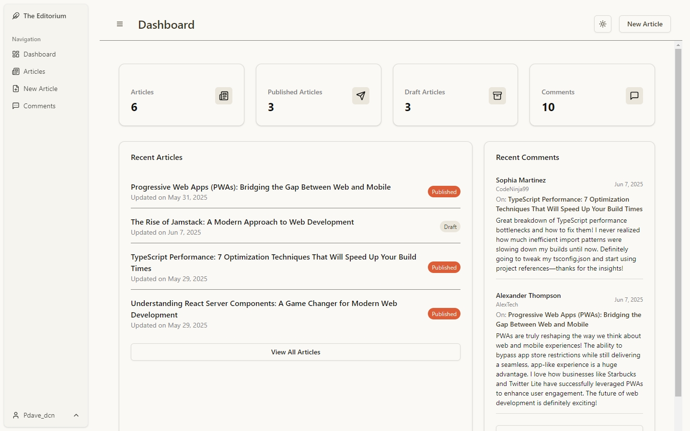
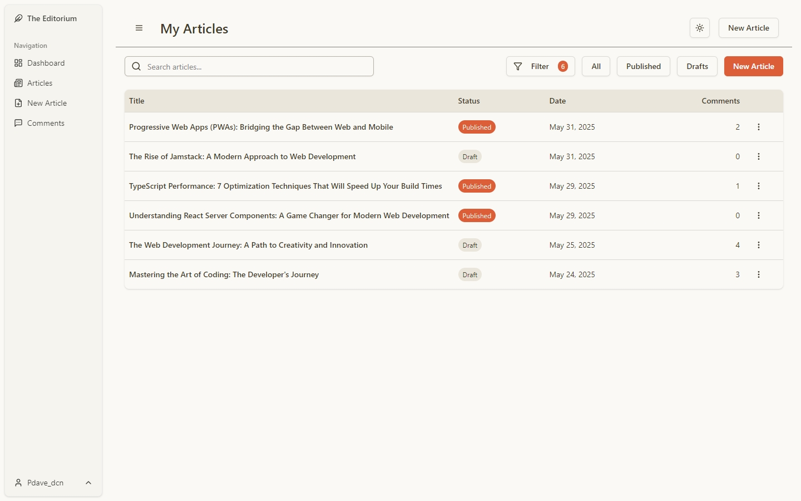
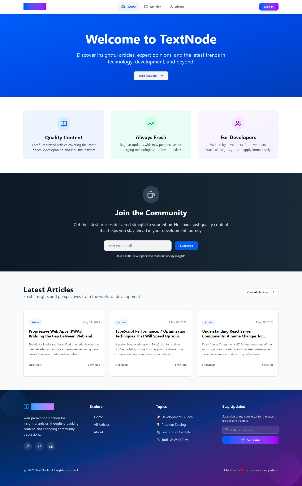
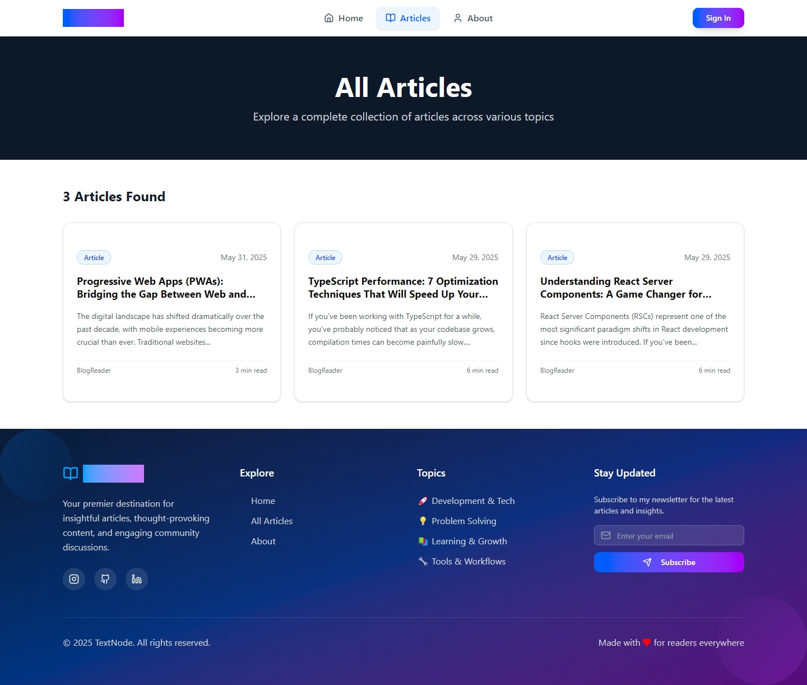

# TextNode Blog Project

A full-stack blog platform featuring a modern React/TypeScript frontend (with separate reader and editor apps) and a Node.js/Prisma API backend. The project is designed for both readers and content creators, supporting article publishing, commenting, and user roles.

---

## 📖 Table of Contents

- [Live Demo](#-live-demo)
- [Project Structure](#-project-structure)
- [Tech Stack](#-tech-stack)
- [Features](#-features)
- [Getting Started](#getting-started)
- [Development Notes](#development-notes)
- [License](#license)
- [Credits](#credits)

---

## 🚀 Live Demo

Coming soon!

---

## Screenshots






---

## 📁 Project Structure

```
blog-project/
│
├── api/                # Node.js + Express + Prisma backend API
│
├── frontend-reader/    # Public-facing blog reader (React + Vite)
│
└── frontend-editor/    # Author/editor dashboard (React + Vite)
```

---

## 🛠 Tech Stack

- **Frontend**: React, TypeScript, Vite, Tailwind CSS, ShadCN UI, Framer Motion
- **Backend**: Node.js, Express, TypeScript, Prisma ORM, PostgreSQL
- **Editor**: TinyMCE Rich Text Editor
- **Authentication**: Passport.js (Local & JWT), role-based access control (User / Author)
- **Dev Tools**: Monorepo with npm workspaces, ESLint, Prettier, dotenv

---

## ✨ Features

### API (`/api`)

- Built with Node.js, Express, and TypeScript
- Prisma ORM with PostgreSQL
- JWT-based authentication with Passport (Local & JWT)
- RESTful API for users, posts, and comments
- Role-based access: user vs. author
- Draft and published states for articles
- Threaded comments with nested replies

### Frontend Reader (`/frontend-reader`)

- React + TypeScript + Vite
- Public blog interface: browse, search, and read articles
- Animated, responsive UI using Tailwind CSS and Framer Motion
- Article details with threaded comments
- Static pages: Home, About, and Articles

### Frontend Editor (`/frontend-editor`)

- React + TypeScript + Vite
- Secure dashboard for authors
- Rich text editing with TinyMCE
- Article creation, editing, publishing, and draft management
- Comment moderation tools
- Accessible only to authenticated users with the `author` role

---

## Getting Started

### Prerequisites

- Node.js (18+ recommended)
- npm or yarn
- PostgreSQL (or SQLite for development)

### 1. Clone the repository

```bash
git clone https://github.com/your-username/textnode-blog-project.git
cd blog-project
```

### 2. Setup the API

```bash
cd api
cp .env.example .env
# Edit .env with your database credentials
npm install
npx prisma migrate dev
npm run dev
```

### 3. Setup the Frontend Reader

```bash
cd ../frontend-reader
cp .env.example .env
npm install
npm run dev
```

### 4. Setup the Frontend Editor

```bash
cd ../frontend-editor
cp .env.example .env
npm install
npm run dev
```

---

## Development Notes

- Both frontends use Vite, React, TypeScript, ShadCN UI, Tailwind CSS, and Framer Motion.
- The editor app is restricted to user with the `author` role.
- ESLint and Prettier are configured for code quality.
- Environment variables are required for API URLs and authentication.

---

## License

MIT

---

## Credits

- Built by [David P.](https://www.linkedin.com/in/davidp919)
- Inspired by modern developer blogs and open-source best practices.
